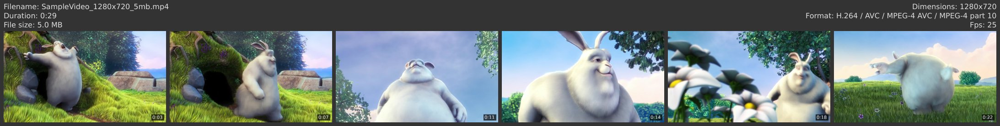

# GoVCS
Creates video contact sheets for quick overview of the content of a video file.



## Usage

* `govcs SampleVideo_1280x720_5mb.mp4` to create a contact sheet using the default values or your configuration file.

* `govcs *mp4` to create sheets for all files in the filter

## Installation
Grab a binary release or compile it yourself. Requires `ffmpeg` and `ffprobe` to be available (somewhere).

### Building

`go build .` to build for your platform.

## Help
```
Generate contact sheets for the given video files

Usage:
  govcs [flags] [files]

Flags:
      --bg_color string       hex string for background color (default "333333")
  -c, --columns int           number of columns to align the stills (default 6)
      --config string         config file (default is $HOME/.govcs.yaml)
      --ffmpeg_path string    path to the ffmpeg executable (default "ffmpeg")
      --ffprobe_path string   path to the ffprobe executable (default "ffprobe")
      --font_color string     hex string for header text color (default "DDDDDD")
      --font_family string    font family to use (default "Deja Vu Sans")
      --font_size int         font size for header (default 16)
      --format string         save file as jpg or png (default "jpg")
  -h, --help                  help for govcs
      --ignore_extension      ignore file extension check to detect non-video formats
      --jpg_quality int       quality of the jpeg when format is set to jpg (default 85)
  -n, --number int            number of still frames to take (default 6)
  -o, --overwrite             overwrite existing files
      --padding int           padding whitespace (default 8)
  -q, --quiet                 hide usual output
      --thumb_height int      height of the generated stills (default 200)
  -v, --verbose               show extra output
      --version               version for govcs

```

## Config file
The program looks for an optional config file at `$HOME/.govcs.yaml`. Alternatively you can provide
the path with the `--config` flag. Settings have the same name as the flag. Configuration file values get overridden by flags.
Example of a config with default values:
```yaml
number: 6 # Number of stills to take
columns: 6 # Number of columns to arrange the images in
padding: 8 # Padding around edges of image and between images
thumb_height: 200 # Height of the stills (width calculated to keep aspect)
font_size: 16 # Font size for the header info
font_family: Deja Vu Sans # Font family to look for
bg_color: 333333 # Background color for the image (hex string)
font_color: DDDDDD # Font color for the header (hex string) 
format: jpg # File format of the resulting image (jpg or png)
jpg_quality: 85 # Quality setting to use when writing file in jpg format
overwrite: false # Overwrite existing vcs file if found. Skips vcs generation if false
ffmpeg_path: ffmpeg # Path to the ffmpeg executable (if not in path)
ffprobe_path: ffprobe # Path to the ffprobe executable (if not in path)
verbose: false # Whether to show extra output
quiet: false # Less output
ignore_extension: false # Whether to skip the file extension check to filter out non video files
```